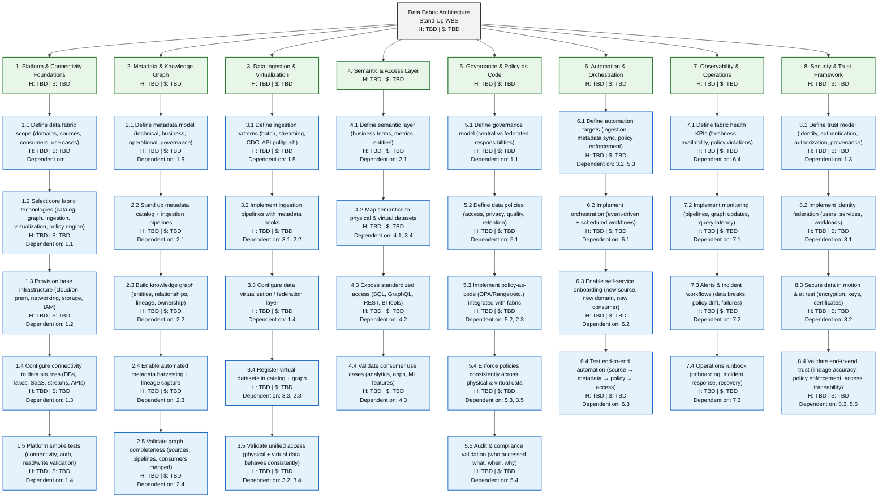

```mermaid
flowchart TB
  A["Data Fabric Architecture<br/>Stand-Up WBS<br/>H: TBD | $: TBD"]:::summary

  A --> I["1. Platform & Connectivity Foundations<br/>H: TBD | $: TBD"]:::phase
  A --> B["2. Metadata & Knowledge Graph<br/>H: TBD | $: TBD"]:::phase
  A --> C["3. Data Ingestion & Virtualization<br/>H: TBD | $: TBD"]:::phase
  A --> D["4. Semantic & Access Layer<br/>H: TBD | $: TBD"]:::phase
  A --> E["5. Governance & Policy-as-Code<br/>H: TBD | $: TBD"]:::phase
  A --> F["6. Automation & Orchestration<br/>H: TBD | $: TBD"]:::phase
  A --> G["7. Observability & Operations<br/>H: TBD | $: TBD"]:::phase
  A --> H["8. Security & Trust Framework<br/>H: TBD | $: TBD"]:::phase

  %% 1. Platform & Connectivity Foundations
  I --> I1["1.1 Define data fabric scope (domains, sources, consumers, use cases)<br/>H: TBD | $: TBD<br/>Dependent on: —"]:::task
  I1 --> I2["1.2 Select core fabric technologies (catalog, graph, ingestion, virtualization, policy engine)<br/>H: TBD | $: TBD<br/>Dependent on: 1.1"]:::task
  I2 --> I3["1.3 Provision base infrastructure (cloud/on-prem, networking, storage, IAM)<br/>H: TBD | $: TBD<br/>Dependent on: 1.2"]:::task
  I3 --> I4["1.4 Configure connectivity to data sources (DBs, lakes, SaaS, streams, APIs)<br/>H: TBD | $: TBD<br/>Dependent on: 1.3"]:::task
  I4 --> I5["1.5 Platform smoke tests (connectivity, auth, read/write validation)<br/>H: TBD | $: TBD<br/>Dependent on: 1.4"]:::task

  %% 2. Metadata & Knowledge Graph
  B --> B1["2.1 Define metadata model (technical, business, operational, governance)<br/>H: TBD | $: TBD<br/>Dependent on: 1.5"]:::task
  B1 --> B2["2.2 Stand up metadata catalog + ingestion pipelines<br/>H: TBD | $: TBD<br/>Dependent on: 2.1"]:::task
  B2 --> B3["2.3 Build knowledge graph (entities, relationships, lineage, ownership)<br/>H: TBD | $: TBD<br/>Dependent on: 2.2"]:::task
  B3 --> B4["2.4 Enable automated metadata harvesting + lineage capture<br/>H: TBD | $: TBD<br/>Dependent on: 2.3"]:::task
  B4 --> B5["2.5 Validate graph completeness (sources, pipelines, consumers mapped)<br/>H: TBD | $: TBD<br/>Dependent on: 2.4"]:::task

  %% 3. Data Ingestion & Virtualization
  C --> C1["3.1 Define ingestion patterns (batch, streaming, CDC, API pull/push)<br/>H: TBD | $: TBD<br/>Dependent on: 1.5"]:::task
  C1 --> C2["3.2 Implement ingestion pipelines with metadata hooks<br/>H: TBD | $: TBD<br/>Dependent on: 3.1, 2.2"]:::task
  C2 --> C3["3.3 Configure data virtualization / federation layer<br/>H: TBD | $: TBD<br/>Dependent on: 1.4"]:::task
  C3 --> C4["3.4 Register virtual datasets in catalog + graph<br/>H: TBD | $: TBD<br/>Dependent on: 3.3, 2.3"]:::task
  C4 --> C5["3.5 Validate unified access (physical + virtual data behaves consistently)<br/>H: TBD | $: TBD<br/>Dependent on: 3.2, 3.4"]:::task

  %% 4. Semantic & Access Layer
  D --> D1["4.1 Define semantic layer (business terms, metrics, entities)<br/>H: TBD | $: TBD<br/>Dependent on: 2.1"]:::task
  D1 --> D2["4.2 Map semantics to physical & virtual datasets<br/>H: TBD | $: TBD<br/>Dependent on: 4.1, 3.4"]:::task
  D2 --> D3["4.3 Expose standardized access (SQL, GraphQL, REST, BI tools)<br/>H: TBD | $: TBD<br/>Dependent on: 4.2"]:::task
  D3 --> D4["4.4 Validate consumer use cases (analytics, apps, ML features)<br/>H: TBD | $: TBD<br/>Dependent on: 4.3"]:::task

  %% 5. Governance & Policy-as-Code
  E --> E1["5.1 Define governance model (central vs federated responsibilities)<br/>H: TBD | $: TBD<br/>Dependent on: 1.1"]:::task
  E1 --> E2["5.2 Define data policies (access, privacy, quality, retention)<br/>H: TBD | $: TBD<br/>Dependent on: 5.1"]:::task
  E2 --> E3["5.3 Implement policy-as-code (OPA/Ranger/etc.) integrated with fabric<br/>H: TBD | $: TBD<br/>Dependent on: 5.2, 2.3"]:::task
  E3 --> E4["5.4 Enforce policies consistently across physical & virtual data<br/>H: TBD | $: TBD<br/>Dependent on: 5.3, 3.5"]:::task
  E4 --> E5["5.5 Audit & compliance validation (who accessed what, when, why)<br/>H: TBD | $: TBD<br/>Dependent on: 5.4"]:::task

  %% 6. Automation & Orchestration
  F --> F1["6.1 Define automation targets (ingestion, metadata sync, policy enforcement)<br/>H: TBD | $: TBD<br/>Dependent on: 3.2, 5.3"]:::task
  F1 --> F2["6.2 Implement orchestration (event-driven + scheduled workflows)<br/>H: TBD | $: TBD<br/>Dependent on: 6.1"]:::task
  F2 --> F3["6.3 Enable self-service onboarding (new source, new domain, new consumer)<br/>H: TBD | $: TBD<br/>Dependent on: 6.2"]:::task
  F3 --> F4["6.4 Test end-to-end automation (source → metadata → policy → access)<br/>H: TBD | $: TBD<br/>Dependent on: 6.3"]:::task

  %% 7. Observability & Operations
  G --> G1["7.1 Define fabric health KPIs (freshness, availability, policy violations)<br/>H: TBD | $: TBD<br/>Dependent on: 6.4"]:::task
  G1 --> G2["7.2 Implement monitoring (pipelines, graph updates, query latency)<br/>H: TBD | $: TBD<br/>Dependent on: 7.1"]:::task
  G2 --> G3["7.3 Alerts & incident workflows (data breaks, policy drift, failures)<br/>H: TBD | $: TBD<br/>Dependent on: 7.2"]:::task
  G3 --> G4["7.4 Operations runbook (onboarding, incident response, recovery)<br/>H: TBD | $: TBD<br/>Dependent on: 7.3"]:::task

  %% 8. Security & Trust Framework
  H --> H1["8.1 Define trust model (identity, authentication, authorization, provenance)<br/>H: TBD | $: TBD<br/>Dependent on: 1.3"]:::task
  H1 --> H2["8.2 Implement identity federation (users, services, workloads)<br/>H: TBD | $: TBD<br/>Dependent on: 8.1"]:::task
  H2 --> H3["8.3 Secure data in motion & at rest (encryption, keys, certificates)<br/>H: TBD | $: TBD<br/>Dependent on: 8.2"]:::task
  H3 --> H4["8.4 Validate end-to-end trust (lineage accuracy, policy enforcement, access traceability)<br/>H: TBD | $: TBD<br/>Dependent on: 8.3, 5.5"]:::task

  classDef summary fill:#f2f2f2,stroke:#333,stroke-width:2px,color:#111;
  classDef phase fill:#e8f5e9,stroke:#2e7d32,stroke-width:2px,color:#111;
  classDef task fill:#e3f2fd,stroke:#1565c0,stroke-width:1.5px,color:#111;
```