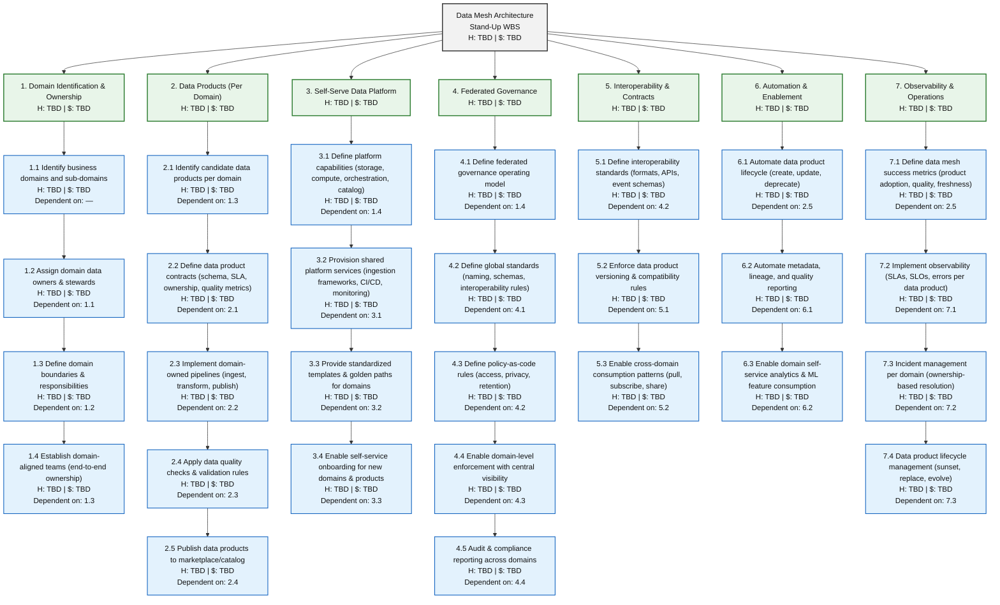

```mermaid
flowchart TB
  A["Data Mesh Architecture<br/>Stand-Up WBS<br/>H: TBD | $: TBD"]:::summary

  A --> B["1. Domain Identification & Ownership<br/>H: TBD | $: TBD"]:::phase
  A --> C["2. Data Products (Per Domain)<br/>H: TBD | $: TBD"]:::phase
  A --> D["3. Self-Serve Data Platform<br/>H: TBD | $: TBD"]:::phase
  A --> E["4. Federated Governance<br/>H: TBD | $: TBD"]:::phase
  A --> F["5. Interoperability & Contracts<br/>H: TBD | $: TBD"]:::phase
  A --> G["6. Automation & Enablement<br/>H: TBD | $: TBD"]:::phase
  A --> H["7. Observability & Operations<br/>H: TBD | $: TBD"]:::phase

  %% 1. Domain Identification & Ownership
  B --> B1["1.1 Identify business domains and sub-domains<br/>H: TBD | $: TBD<br/>Dependent on: —"]:::task
  B1 --> B2["1.2 Assign domain data owners & stewards<br/>H: TBD | $: TBD<br/>Dependent on: 1.1"]:::task
  B2 --> B3["1.3 Define domain boundaries & responsibilities<br/>H: TBD | $: TBD<br/>Dependent on: 1.2"]:::task
  B3 --> B4["1.4 Establish domain-aligned teams (end-to-end ownership)<br/>H: TBD | $: TBD<br/>Dependent on: 1.3"]:::task

  %% 2. Data Products (Per Domain)
  C --> C1["2.1 Identify candidate data products per domain<br/>H: TBD | $: TBD<br/>Dependent on: 1.3"]:::task
  C1 --> C2["2.2 Define data product contracts (schema, SLA, ownership, quality metrics)<br/>H: TBD | $: TBD<br/>Dependent on: 2.1"]:::task
  C2 --> C3["2.3 Implement domain-owned pipelines (ingest, transform, publish)<br/>H: TBD | $: TBD<br/>Dependent on: 2.2"]:::task
  C3 --> C4["2.4 Apply data quality checks & validation rules<br/>H: TBD | $: TBD<br/>Dependent on: 2.3"]:::task
  C4 --> C5["2.5 Publish data products to marketplace/catalog<br/>H: TBD | $: TBD<br/>Dependent on: 2.4"]:::task

  %% 3. Self-Serve Data Platform
  D --> D1["3.1 Define platform capabilities (storage, compute, orchestration, catalog)<br/>H: TBD | $: TBD<br/>Dependent on: 1.4"]:::task
  D1 --> D2["3.2 Provision shared platform services (ingestion frameworks, CI/CD, monitoring)<br/>H: TBD | $: TBD<br/>Dependent on: 3.1"]:::task
  D2 --> D3["3.3 Provide standardized templates & golden paths for domains<br/>H: TBD | $: TBD<br/>Dependent on: 3.2"]:::task
  D3 --> D4["3.4 Enable self-service onboarding for new domains & products<br/>H: TBD | $: TBD<br/>Dependent on: 3.3"]:::task

  %% 4. Federated Governance
  E --> E1["4.1 Define federated governance operating model<br/>H: TBD | $: TBD<br/>Dependent on: 1.4"]:::task
  E1 --> E2["4.2 Define global standards (naming, schemas, interoperability rules)<br/>H: TBD | $: TBD<br/>Dependent on: 4.1"]:::task
  E2 --> E3["4.3 Define policy-as-code rules (access, privacy, retention)<br/>H: TBD | $: TBD<br/>Dependent on: 4.2"]:::task
  E3 --> E4["4.4 Enable domain-level enforcement with central visibility<br/>H: TBD | $: TBD<br/>Dependent on: 4.3"]:::task
  E4 --> E5["4.5 Audit & compliance reporting across domains<br/>H: TBD | $: TBD<br/>Dependent on: 4.4"]:::task

  %% 5. Interoperability & Contracts
  F --> F1["5.1 Define interoperability standards (formats, APIs, event schemas)<br/>H: TBD | $: TBD<br/>Dependent on: 4.2"]:::task
  F1 --> F2["5.2 Enforce data product versioning & compatibility rules<br/>H: TBD | $: TBD<br/>Dependent on: 5.1"]:::task
  F2 --> F3["5.3 Enable cross-domain consumption patterns (pull, subscribe, share)<br/>H: TBD | $: TBD<br/>Dependent on: 5.2"]:::task

  %% 6. Automation & Enablement
  G --> G1["6.1 Automate data product lifecycle (create, update, deprecate)<br/>H: TBD | $: TBD<br/>Dependent on: 2.5"]:::task
  G1 --> G2["6.2 Automate metadata, lineage, and quality reporting<br/>H: TBD | $: TBD<br/>Dependent on: 6.1"]:::task
  G2 --> G3["6.3 Enable domain self-service analytics & ML feature consumption<br/>H: TBD | $: TBD<br/>Dependent on: 6.2"]:::task

  %% 7. Observability & Operations
  H --> H1["7.1 Define data mesh success metrics (product adoption, quality, freshness)<br/>H: TBD | $: TBD<br/>Dependent on: 2.5"]:::task
  H1 --> H2["7.2 Implement observability (SLAs, SLOs, errors per data product)<br/>H: TBD | $: TBD<br/>Dependent on: 7.1"]:::task
  H2 --> H3["7.3 Incident management per domain (ownership-based resolution)<br/>H: TBD | $: TBD<br/>Dependent on: 7.2"]:::task
  H3 --> H4["7.4 Data product lifecycle management (sunset, replace, evolve)<br/>H: TBD | $: TBD<br/>Dependent on: 7.3"]:::task

  classDef summary fill:#f2f2f2,stroke:#333,stroke-width:2px,color:#111;
  classDef phase fill:#e8f5e9,stroke:#2e7d32,stroke-width:2px,color:#111;
  classDef task fill:#e3f2fd,stroke:#1565c0,stroke-width:1.5px,color:#111;

```